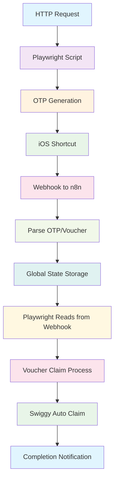

# Voucher Automation System

A comprehensive automation system for buying and claiming Swiggy vouchers from AmEx Gyftr Portal using n8n webhooks, Playwright automation, and iOS shortcuts.

## 🏗️ System Architecture



## 📋 Prerequisites

- Node.js (v16 or higher)
- Python 3.8+
- n8n instance (cloud or self-hosted)
- iOS device with Shortcuts app
- AmEx card with Gyftr access
- Swiggy account

## 🚀 Quick Start

### 1. Environment Setup

```bash
# Clone the repository
git clone <repository-url>
cd automate_vouchers

# Install dependencies
npm install

# Create environment file
cp example.env .env
```

### 2. Environment Variables

Create a `.env` file with the following variables:

```env
# AmEx Gyftr Credentials
MOBILE=your_mobile_number
EMAIL=your_email@example.com
CARD_CVV=your_card_cvv

# n8n Configuration
N8N_BASE_URL=https://your-n8n-instance.com
WEBHOOK_PATH=/webhook/ios-sms

# Swiggy Voucher Claim (Optional)
SWIGGY_VOUCHER_CLAIM_URL=https://chkout.swiggy.com/swiggymoney/voucher/claim
```

## 📱 iOS Shortcuts Setup

### Step 1: Create the Shortcut

1. Open the **Shortcuts** app on your iOS device
2. Tap the **+** button to create a new shortcut
3. Name it "SMS to Webhook"

### Step 2: Add SMS Trigger

1. Tap **Add Action**
2. Search for "Messages" and select **Get Messages**
3. Configure:
   - **Messages**: All Messages
   - **Limit**: 1
   - **Filter**: From [your SMS sender]

### Step 3: Add HTTP Request

1. Tap **Add Action** again
2. Search for "Get Contents of URL"
3. Configure:
   - **URL**: `https://your-n8n-instance.com/webhook/ios-sms`
   - **Method**: POST
    - **Request Headers**:
     - `Content-Type`: `application/json`
   - **Request Body**: JSON

     ```json
     {
       "text": "{{Shortcut Input}}"
     }
     ```

### Step 4: Add Automation Trigger

1. Go to **Automation** tab
2. Tap **+** → **Create Personal Automation**
3. Select **Message**
4. Configure:
   - **From**: [SMS sender name/number]
   - **Message Contains**: [OTP keywords like "OTP", "SafeKey", "voucher"]
5. Add action: **Run Shortcut** → Select your "SMS to Webhook" shortcut

### Step 5: Test the Setup

1. Send a test SMS to your device
2. Check if the webhook receives the message
3. Verify the automation runs automatically

## 🔧 n8n Workflow Setup

### 1. Import the Workflow

1. Open your n8n instance
2. Go to **Workflows** → **Import from File**
3. Upload the `n8n-otp-voucher-workflow.json` file

### 2. Configure Webhook

1. Open the imported workflow
2. Click on the **OTP/Voucher Webhook** node
3. Copy the webhook URL
4. Update your iOS shortcut with this URL

### 3. Activate the Workflow

1. Click **Save** and then **Activate**
2. Test with a sample SMS message
3. Verify the parser extracts OTPs correctly

## 🤖 Playwright Automation

### Running the Automation

```bash
# Start the automation
npm start

# Or run directly
node gyftr_automate.js
```

### What the Script Does

1. **Launches Browser**: Opens Chromium in headless mode
2. **Navigates to Gyftr**: Goes to AmEx Gyftr portal
3. **Logs In**: Uses your credentials from environment variables
4. **Selects Card**: Chooses between Gold charge card or Members rewards
5. **Waits for OTP**: Polls n8n webhook for mobile OTP
6. **Enters OTP**: Automatically fills the OTP when received
7. **Waits for Payment OTP**: Polls for SafeKey/payment OTP
8. **Completes Purchase**: Finalizes the voucher purchase
9. **Notifies Completion**: Sends voucher data back to n8n

### OTP Polling Logic

The script polls the n8n webhook every 3 seconds for:

- **Mobile OTP**: For login verification
- **Payment OTP**: For SafeKey/bank verification
- **Voucher Data**: For automatic claiming

## 🎫 Swiggy Voucher Auto-Claim

### Automatic Claiming

The n8n workflow automatically:

1. **Detects Swiggy Vouchers**: Parses voucher codes and PINs
2. **Claims Automatically**: Sends PATCH request to Swiggy API
3. **Handles Responses**:

- Status 0: Successfully claimed
- Status 7: Already claimed
- Other: Error handling

### Manual Claiming

If you prefer manual claiming:

```bash
# Install Python dependencies
pip install -r requirements.txt

# Run the Python script
python voucher_claim.py

# Enter voucher details when prompted
```

## 📊 System Flow

### Complete Process Flow

1. **HTTP Request** → Triggers Playwright automation
2. **Playwright Script** → Opens browser and navigates to Gyftr
3. **OTP Generation** → AmEx sends SMS with OTP
4. **iOS Shortcut** → Captures SMS and sends to webhook
5. **n8n Webhook** → Receives and parses the message
6. **Global State** → Stores OTP with 40-second TTL
7. **Playwright Polling** → Reads OTP from webhook
8. **Voucher Purchase** → Completes the transaction
9. **Voucher SMS** → Gyftr sends voucher details
10. **Auto-Claim** → n8n claims Swiggy voucher automatically
11. **Completion** → System notifies success/failure

### Error Handling

- **OTP Timeout**: 2-minute timeout for OTP retrieval
- **Webhook Failures**: Retry logic with exponential backoff
- **Browser Crashes**: Automatic restart and recovery
- **Network Issues**: Graceful degradation and retry

## 🔍 Monitoring & Debugging

### Logs

The system provides detailed logging:

- ✅ Success operations
- ⚠️ Warnings and retries
- ❌ Errors with stack traces
- 📱 OTP polling status
- 🎫 Voucher claim results

### Health Checks

```bash
# Check webhook health
curl -X POST https://your-n8n-instance.com/webhook/ios-sms \
  -H "Content-Type: application/json" \
  -d '{"message": "__GET_STATE__", "type": "status_check"}'
```

## 🛠️ Troubleshooting

### Common Issues

1. **iOS Shortcut Not Triggering**
   - Check automation permissions
   - Verify SMS sender configuration
   - Test webhook URL manually

2. **OTP Not Being Received**
   - Check n8n workflow activation
   - Verify webhook URL in shortcut
   - Check SMS parsing patterns

3. **Playwright Script Failing**
   - Verify environment variables
   - Check network connectivity
   - Review browser logs

4. **Voucher Claim Failing**
   - Check Swiggy API credentials
   - Verify voucher format
   - Review claim response

### Debug Commands

```bash
# Test webhook connectivity
curl -X POST $N8N_BASE_URL$WEBHOOK_PATH \
  -H "Content-Type: application/json" \
  -d '{"text": "Test message"}'

# Check environment variables
node -e "require('dotenv').config(); console.log(process.env)"
```

## 📈 Performance Optimization

### Best Practices

1. **TTL Management**: 40-second TTL prevents stale data
2. **Polling Intervals**: 3-second intervals balance responsiveness and load
3. **Error Recovery**: Exponential backoff for failed requests
4. **Resource Cleanup**: Automatic browser cleanup on completion

### Scaling Considerations

- **Multiple Instances**: Can run multiple Playwright instances
- **Load Balancing**: Distribute webhook load across instances
- **Database Storage**: Consider persistent storage for high-volume usage

## 🔒 Security Considerations

### Data Protection

- **Environment Variables**: Sensitive data stored in `.env`
- **Webhook Security**: Use HTTPS for all webhook communications
- **API Keys**: Rotate Swiggy API credentials regularly
- **Log Sanitization**: OTPs are not logged in plain text

### Access Control

- **n8n Security**: Implement proper authentication
- **Webhook Validation**: Validate incoming webhook requests
- **Rate Limiting**: Implement rate limiting for webhook endpoints

## 📝 Configuration Files

### n8n Workflow (`n8n-otp-voucher-workflow.json`)

Contains the complete workflow with:

- Webhook endpoint configuration
- OTP/Voucher parsing logic
- Swiggy voucher claiming
- Response handling

### Playwright Script (`gyftr_automate.js`)

Main automation script with:

- Browser automation logic
- Webhook polling
- Error handling
- Completion notifications

### Python Script (`voucher_claim.py`)

Manual voucher claiming with:

- Swiggy API integration
- Response parsing
- Error handling

## 🤝 Contributing

1. Fork the repository
2. Create a feature branch
3. Make your changes
4. Test thoroughly
5. Submit a pull request

## 📄 License

This project is licensed under the BSD 2-Clause License.

## 🆘 Support

For issues and questions:

1. Check the troubleshooting section
2. Review the logs for error details
3. Test individual components
4. Create an issue with detailed information

---

**Note**: This automation system is for educational purposes. Ensure compliance with AmEx and Swiggy terms of service before use in production environments.
