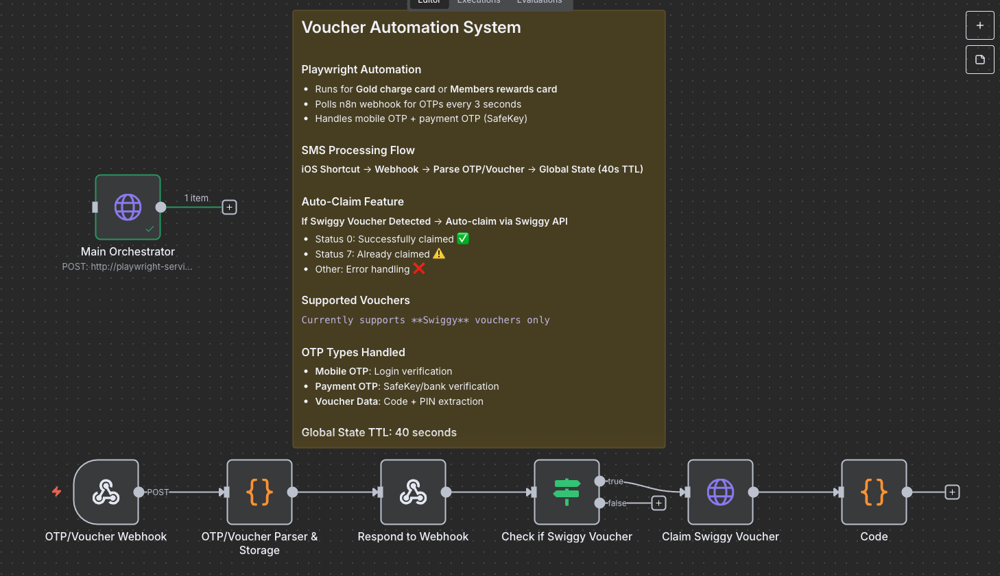
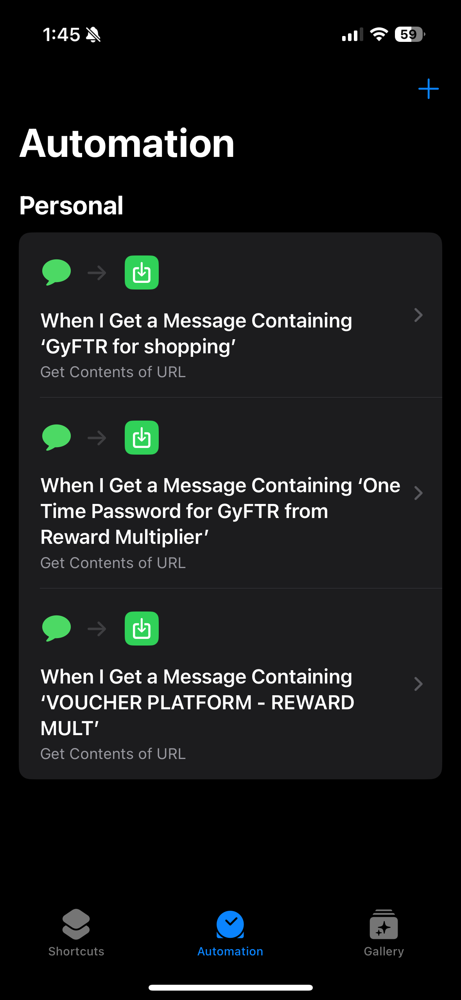
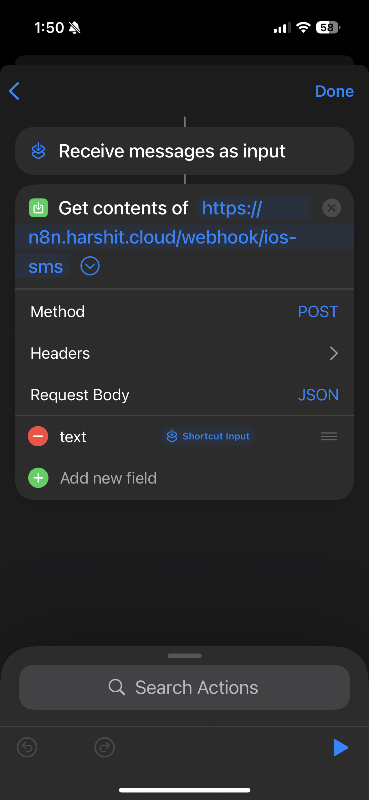

# Voucher Automation System

Automate buying gift vouchers from the AmEx **ShopWise** (Giftstacc) portal using Playwright, n8n webhooks, and an iOS Shortcut. (The original Gyftr flow is retired — see `SHOPWISE_FLOW.md`.)

## 🟢 ShopWise — quick start (current platform)

```bash
npm install
cp example.env .env        # set MOBILE and N8N_BASE_URL (e.g. https://n8n.harshit.cloud)

# 1) Safe dry run — logs in (OTP auto-fetched from n8n) + selects vouchers, but never pays:
node shopwise_automate.js --plan shopwise-plan.example.json --dry-run

# 2) Watch it live (a window opens):
HEADLESS=false node shopwise_automate.js --plan shopwise-plan.example.json --dry-run

# 3) Real run of a whole plan (buys every job, N times each):
node shopwise_automate.js --plan shopwise-plan.example.json

# Run just one job, or pause for manual SafeKey entry while the iframe step is hardened:
node shopwise_automate.js --plan plan.json --only 0
MANUAL_3DS=true node shopwise_automate.js --plan plan.json

# As a service: POST /run {plan|planFile, dryRun, only} on :3000
node shopwise_automate.js --serve
```

- **Plan format:** `shopwise-plan.example.json` — `brands` (name→productId), `cards` (name→PayU saved-card slot), and `jobs` (`brand`, `card`, `denominations`, `count`). Each `count` = a separate transaction (one milestone tick).
- **OTPs** (login + SafeKey) are pulled automatically from n8n, fed by the iOS Shortcut relay (triggers: `ShopWise login OTP`, `CUSTCAP SOLUTIONS`, `E-Gift Voucher`; POST to `<n8n>/webhook/ios-sms`).
- **n8n parser:** apply `shopwise-parser.js` to the "OTP/Voucher Parser & Storage" code node (+ add the `login_otp` line to the Respond node — see `SHOPWISE_FLOW.md`).

---

### Legacy (Gyftr) — retained for reference only


## 🎬 Demo

> Demo video: [Watch the MP4](assets/Voucher%20Automation.mp4)



## ✨ Features

- Headless Playwright automation for Gyftr checkout
- iOS Shortcuts → n8n webhook → OTP/voucher parsing
- Auto-claim Swiggy vouchers via API (optional)

## 📦 Prerequisites

- Node.js 16+
- Python 3.8+
- An n8n instance (cloud or self-hosted)
- iOS device with the Shortcuts app

## 🚀 Quick Start

```bash
# Clone and install
git clone <repository-url>
cd automate_vouchers
npm install

# Create environment file
cp example.env .env
```

## 🔧 Configure

Set the following in `.env` (see `example.env` for all options):

- MOBILE, EMAIL, MEMBERSHIP_CARD_CVV, GOLDCHARGE_CARD_CVV, USE_GOLDCHARGE_CARD
- N8N_BASE_URL, WEBHOOK_PATH
- Optional for auto-claim: SWIGGY_VOUCHER_CLAIM_URL, SWIGGY_DEVICE_ID, SWIGGY_TID, SWIGGY_TOKEN

## ▶️ Run

- One-off automation:

```bash
npm start
# or
node gyftr_automate.js
```

- Service mode (HTTP trigger on :3000):

```bash
npm run service
# POST http://localhost:3000/start  { "goldCharge": true|false }
```

- Docker:

```bash
docker-compose up -d
```

## 📱 iOS Shortcut (SMS → Webhook)

1. Create a new Shortcut
2. Add “Get Contents of URL”
   - URL: `<your-n8n>/webhook/ios-sms`
   - Method: POST
   - Headers: `Content-Type: application/json`
   - Body (JSON): `{ "text": "{{Shortcut Input}}" }`
3. Create an Automation → “Message” trigger
   - From: your SMS sender(s)
   - Contains: keywords like “OTP”, “SafeKey”, “voucher”
4. Action: Run your Shortcut

Visual guide:





## 🔁 n8n Workflow

1. Import `n8n-otp-voucher-workflow.json`
2. Copy the webhook URL and use it in your Shortcut
3. Activate the workflow

The workflow stores OTPs/voucher data briefly (TTL ~40s) and can auto-claim Swiggy vouchers if headers are provided via env.

## 🎫 Swiggy Auto-Claim (Optional)

- Configure `SWIGGY_*` env vars
- The workflow will PATCH `SWIGGY_VOUCHER_CLAIM_URL` with code + pin
- Responses handled: success (0), already claimed (7), other errors

## 🧱 Architecture & Advanced Docs

See `SYSTEM_ARCHITECTURE.md` for full flow, diagrams, and advanced notes.

## 🤝 Contributing

See `CONTRIBUTING.md`. Please don’t include secrets in issues/PRs.

## 📄 License

BSD 2-Clause License (see `LICENSE`).
