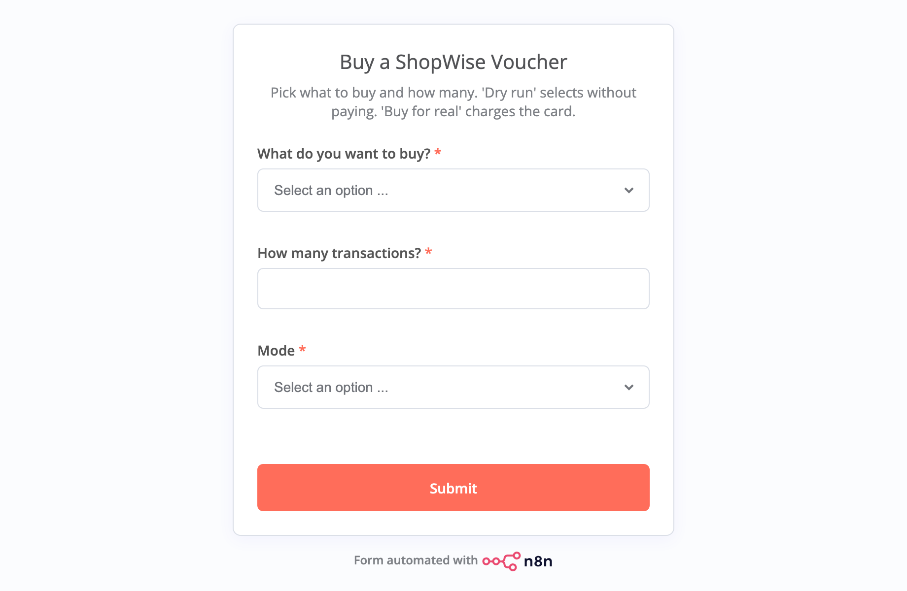

# ShopWise Voucher Automation

Buy AmEx Reward-Multiplier gift vouchers on the **ShopWise** (Giftstacc) portal completely hands-free — login, denomination selection, PayU saved-card payment, **Amex SafeKey OTP auto-fill**, and voucher capture — all driven from one n8n form.

Built on **Playwright + n8n + an iOS Shortcut** that relays SMS OTPs back to the automation, so no human types an OTP.

> Replaces the retired **Gyftr** portal. The old `gyftr_automate.js` / `server.js` are kept for reference only — see [Legacy](#legacy-gyftr).

---

## Buy a voucher (the only thing you normally do)

Open the n8n form, pick an option, submit. That's it.



`https://<your-n8n-host>/form/buy-voucher`

| Field | What it does |
| --- | --- |
| **What do you want to buy?** | Preset options — e.g. `Amazon Pay ₹1,500 — MRCC`, `Swiggy ₹1,500 — MRCC`, `Swiggy ₹1,000 — Gold Charge` |
| **How many transactions?** | Each one is a separate checkout = one milestone tick |
| **Mode** | `Dry run` (no charge) or `Buy for real` |

The form runs the purchase server-side and shows the result + any voucher codes.

---

## How it works

A phone forwards every relevant SMS (login OTP, SafeKey OTP, voucher) to n8n. n8n stores them, hosts the form, and triggers the Playwright container — which drives the browser and pulls those OTPs back on demand.

```
 Phone ──iOS Shortcut──▶ n8n (/webhook/ios-sms)
   SMS: login OTP,          • parses + stores OTPs (short TTL)
   SafeKey OTP, voucher     • ledger: vouchers + milestone counters
                            • "Buy a Voucher" form
                                    │ POST /run {plan}        ▲ poll OTPs
                                    ▼                          │
                       playwright-service container ───────────┘
                       login → product → denominations →
                       PayU saved card → SafeKey OTP →
                       voucher capture → report to ledger
                                    │
                                    ▼
                            ShopWise (Giftstacc)
```

- **Login:** mobile number + 4-digit SMS OTP (no password).
- **Payment:** PayU saved "No-CVV" AmEx cards; the SafeKey 3DS OTP is auto-filled from the relayed SMS.
- **Hosting:** n8n + `playwright-service` run together on a Dokploy host.

**Cards & milestones**

| Card | PayU slot | Milestone | Per-brand cap |
| --- | --- | --- | --- |
| Gold Charge | `0` | 6 × ₹1,000 | ₹20,000 / month |
| MRCC | `1` | 4 × ₹1,500 (+₹15k) | ₹20,000 / month |

> Each brand (Amazon Pay, Swiggy, …) has its **own** ₹20k/month cap. When a cap is hit, the automation detects the disabled Buy-now and stops with `MONTHLY_LIMIT_REACHED` instead of hanging.

---

## Components

| File | Role |
| --- | --- |
| `shopwise_automate.js` | The Playwright automation. CLI (`--plan`) and HTTP service (`--serve`): login → denominations → PayU → SafeKey auto-fill → voucher capture → reports to the n8n ledger. |
| `shopwise-parser.js` | n8n Code node: classifies login/payment/voucher SMS, stores OTPs (short TTL) and a persistent ledger (vouchers + per-card counters). |
| `shopwise-buy-form-workflow.json` | **The form** — `Form → Build Plan (catalog) → POST /run → Show result`. |
| `shopwise-orchestrator-workflow.json` | Plan-driven batch (Manual/Schedule trigger) for buying many at once. |
| `n8n-otp-voucher-workflow.json` | The `/webhook/ios-sms` relay → parser → ledger. |
| `shopwise-plan.example.json` | Plan format for CLI/orchestrator runs. |
| `Dockerfile.playwright`, `docker-compose.yml` | The `playwright-service` container (`--serve`, headful under xvfb). |
| `SHOPWISE_FLOW.md` | DOM/flow mapping + SMS formats. |

Playwright is pinned to **1.54.1**.

---

## Setup

```bash
npm install
cp example.env .env          # set MOBILE and N8N_BASE_URL at minimum
docker-compose up -d         # brings up n8n + playwright-service on the host
```

1. Import the three workflow JSONs into n8n; paste `shopwise-parser.js` into the parser Code node; **activate** the OTP handler and the form.
2. Set up the iOS Shortcut relay (below).
3. Open `https://<your-n8n-host>/form/buy-voucher`.

Key env vars (full list in `example.env`): `MOBILE`, `N8N_BASE_URL` (e.g. `http://n8n:5678` in Docker), `WEBHOOK_PATH` (default `/webhook/ios-sms`), `HEADLESS`, `MANUAL_3DS`.

---

## iOS Shortcut relay

The phone forwards three SMS types to n8n so the automation can read them.

1. **Shortcut** → *Get Contents of URL*: `POST https://<your-n8n-host>/webhook/ios-sms`, header `Content-Type: application/json`, body `{ "text": "{{Shortcut Input}}" }`.
2. **Automation → Message** trigger that runs the Shortcut when an SMS contains:
   - `ShopWise login OTP` → login OTP
   - `CUSTCAP SOLUTIONS` → Amex SafeKey (payment) OTP
   - `E-Gift Voucher` → voucher delivery

---

## Adding a new brand / voucher

1. Open the product on ShopWise and copy its `productId` from the URL (`/giftcard?productId=...`).
2. In the form's **"Build Plan from selection"** Code node, add a `CATALOG` line **and** a matching dropdown option:
   ```js
   'Swiggy ₹1,500 — MRCC (1000+500)': { brand: 'swiggy', productId: '67QXkJBH5ual2f8tm2sCvQ==', card: 'mrcc', denominations: [{ amount: 1000, qty: 1 }, { amount: 500, qty: 1 }] }
   ```
3. For CLI/orchestrator runs, add the brand to `brands{}` and a job to `jobs[]` in your plan JSON.

PayU slots: `0` = Gold Charge, `1` = MRCC.

---

## Other run modes (CLI)

```bash
# Dry run — logs in + selects, never pays:
node shopwise_automate.js --plan shopwise-plan.example.json --dry-run

# Real run of a whole plan:
node shopwise_automate.js --plan shopwise-plan.example.json

# HTTP service (what the container runs):
node shopwise_automate.js --serve     # POST /run {plan,dryRun} ; GET /health
```

`HEADLESS=false` to watch the browser; `MANUAL_3DS=true` to enter the SafeKey OTP yourself.

---

## Legacy (Gyftr)

The original Gyftr automation (`gyftr_automate.js`, `server.js`, and `Gyftr`/`SWIGGY_*` env vars) is retired and kept for reference only.

## License

BSD 2-Clause — see [`LICENSE`](LICENSE).
