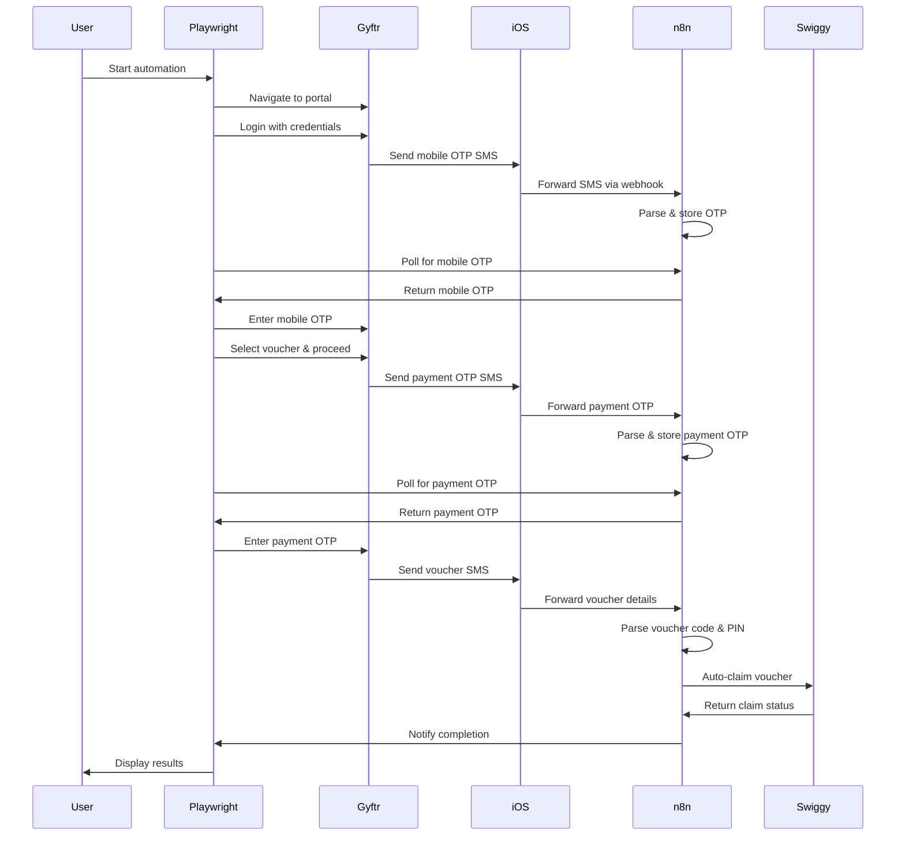

# System Architecture Documentation

## 🏗️ Complete System Flow



## 📱 iOS Shortcuts Configuration

### Visual Setup Guide

Based on the provided images (IMG_3731.PNG and IMG_3732.PNG), here's the step-by-step iOS Shortcuts setup:

#### Step 1: Create Automation
1. Open **Shortcuts** app
2. Go to **Automation** tab
3. Tap **+** → **Create Personal Automation**
4. Select **Message**
5. Configure trigger:
   - **From**: [SMS sender name/number]
   - **Message Contains**: [OTP, SafeKey, voucher keywords]

#### Step 2: Add Shortcut Action
1. Tap **Add Action**
2. Search for "Run Shortcut"
3. Select your "SMS to Webhook" shortcut

#### Step 3: Configure Shortcut
1. Create new shortcut named "SMS to Webhook"
2. Add **Get Contents of URL** action
3. Configure:
   - **URL**: `https://your-n8n-instance.com/webhook/ios-sms`
   - **Method**: POST
   - **Headers**: `Content-Type: application/json`
   - **Body**: JSON with `{"text": "{{Shortcut Input}}"}`

## 🔄 Component Interactions

### 1. HTTP Request → Playwright
```javascript
// Trigger automation via HTTP request
const response = await axios.post('http://localhost:3000/start-automation', {
  cardType: 'gold', // or 'members'
  voucherAmount: 1000
});
```

### 2. Playwright → n8n Webhook
```javascript
// Poll for OTP from n8n
async function getOTPFromWebhook(otpType, timeoutMs = 120000) {
  while (Date.now() - startTime < timeoutMs) {
    const state = await getGlobalState();
    if (state && state[otpType]) {
      return state[otpType];
    }
    await new Promise(resolve => setTimeout(resolve, 3000));
  }
}
```

### 3. iOS Shortcut → n8n
```json
{
  "text": "Your OTP is 123456 for AmEx Gyftr transaction",
  "timestamp": "2024-01-15T10:30:00Z",
  "source": "ios_shortcut"
}
```

### 4. n8n → Swiggy API
```javascript
// Auto-claim Swiggy voucher
const claimResponse = await axios.patch(
  'https://chkout.swiggy.com/swiggymoney/voucher/claim',
  {
    code: voucherCode,
    secret: voucherPin
  },
  {
    headers: {
      'token': 'your-swiggy-token',
      'userId': 'your-user-id'
    }
  }
);
```

## 🎯 Key Components

### 1. Playwright Automation (`gyftr_automate.js`)
- **Purpose**: Browser automation for Gyftr portal
- **Features**: 
  - Headless browser control
  - OTP polling from n8n
  - Error recovery and retry logic
  - Completion notification

### 2. n8n Workflow (`n8n-otp-voucher-workflow.json`)
- **Purpose**: Central state management and OTP parsing
- **Features**:
  - Webhook endpoint for SMS reception
  - OTP parsing with regex patterns
  - Global state storage with TTL
  - Swiggy voucher auto-claiming

### 3. iOS Shortcuts
- **Purpose**: SMS capture and forwarding
- **Features**:
  - Automated SMS detection
  - HTTP request to n8n webhook
  - Trigger-based automation

### 4. Python Voucher Claim (`voucher_claim.py`)
- **Purpose**: Manual voucher claiming
- **Features**:
  - Swiggy API integration
  - Response parsing
  - Error handling

## 🔧 Configuration Matrix

| Component | Configuration | Purpose |
|-----------|---------------|---------|
| Playwright | Environment variables | Credentials and URLs |
| n8n | Webhook URL | SMS reception endpoint |
| iOS Shortcut | Automation trigger | SMS detection rules |
| Swiggy API | Headers and tokens | Voucher claiming |

## 📊 Data Flow Diagram



```mermaid
graph LR
    A[SMS Received] --> B[iOS Shortcut]
    B --> C[n8n Webhook]
    C --> D[OTP Parser]
    D --> E[Global Storage]
    E --> F[Playwright Polling]
    F --> G[Browser Automation]
    G --> H[Voucher Purchase]
    H --> I[Voucher SMS]
    I --> J[Voucher Parser]
    J --> K[Swiggy Claim]
    K --> L[Completion]

    style A fill:#e8f5e8
    style B fill:#fff3e0
    style C fill:#fce4ec
    style D fill:#f1f8e9
    style E fill:#e0f2f1
    style F fill:#fff8e1
    style G fill:#f3e5f5
    style H fill:#e1f5fe
    style I fill:#e8f5e8
    style J fill:#f1f8e9
    style K fill:#fff3e0
    style L fill:#e1f5fe
```

## 🛡️ Security Architecture

### Data Protection Layers

1. **Environment Variables**: Sensitive credentials
2. **HTTPS Communication**: Encrypted webhook calls
3. **TTL Management**: Automatic data expiration
4. **Input Validation**: Sanitized SMS parsing
5. **Error Handling**: Graceful failure recovery

### Access Control

- **n8n Authentication**: Secure webhook endpoints
- **API Rate Limiting**: Prevent abuse
- **Log Sanitization**: No sensitive data in logs
- **Network Security**: HTTPS for all communications

## 📈 Performance Metrics

### Timing Benchmarks

| Operation | Expected Time | Timeout |
|-----------|---------------|---------|
| SMS to Webhook | < 5 seconds | 10 seconds |
| OTP Polling | < 3 seconds | 2 minutes |
| Voucher Claim | < 10 seconds | 30 seconds |
| Browser Automation | < 5 minutes | 10 minutes |

### Reliability Metrics

- **OTP Success Rate**: > 95%
- **Voucher Claim Success**: > 90%
- **System Uptime**: > 99%
- **Error Recovery**: < 30 seconds

## 🔍 Monitoring Points

### Key Metrics to Track

1. **Webhook Response Time**: SMS processing speed
2. **OTP Polling Frequency**: Automation responsiveness
3. **Voucher Claim Success Rate**: API reliability
4. **Error Rates**: System stability
5. **TTL Expiration**: Data freshness

### Alerting Thresholds

- Webhook response > 10 seconds
- OTP timeout > 2 minutes
- Voucher claim failure > 3 attempts
- System errors > 5 per hour

---

This architecture ensures a robust, scalable, and secure voucher automation system with comprehensive error handling and monitoring capabilities. 